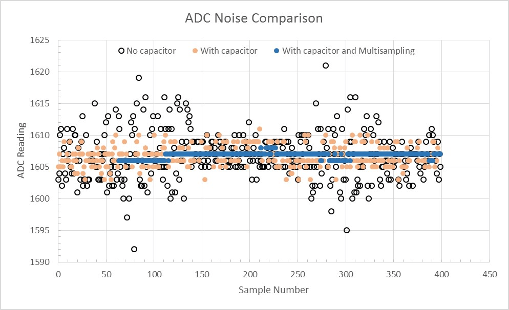

# MicroPython ESP32 ADC1 calibration  
using V_ref calibration value  
<small>information taken from https://github.com/matthias-bs/MicroPython-ADC_Cal  
<small>this document : https://github.com/josmet52/micropython/  
june 2021 / jmb52.dev@gmail.com</small>

#### Principe: a good glimpse is provided in [4]. 
 
- 11 dB attenuation is not implemented
- for voltages over 1750 mV use R1 - R2 divider  
- "Per design the ADC reference voltage is 1100 mV, however the true
  reference voltage can range from 1000 mV to 1200 mV amongst different
  ESP32s." [1]
- Attenuation and "suggested input ranges" [1]

 Attenuation (dB)|Suggested range (mV)
 :--:|:--:
 0 | 100 ~  950   
 2.5 | 100 ~ 1250   
 6 | 150 ~ 1750  
 ~~11~~ | ~~150 ~ 2450~~   
      

# Minimizing Noise
The ESP32 ADC can be sensitive to noise leading to large discrepancies in ADC readings. To minimize noise, users may connect a 0.1 µF capacitor to the ADC input pad in use. Multisampling may also be used to further mitigate the effects of noise.

ADC noise mitigation

<small>Graph illustrating noise mitigation using capacitor and multisampling of 64 samples.</small>

The calibration algorithm and constants are based on [2].

[1] https://docs.espressif.com/projects/esp-idf/en/latest/esp32/api-reference/peripherals/adc.html#adc-calibration  
[2] https://github.com/espressif/esp-idf/blob/master/components/esp_adc_cal/esp_adc_cal_esp32.c  
[3] https://docs.micropython.org/en/latest/esp32/quickref.html #adc-analog-to-digital-conversion  
[4] https://esp32.com/viewtopic.php?t=1045 ([Answered] What are the ADC input ranges?)
# Constants 
https://github.com/espressif/esp-idf/blob/master/components/soc/esp32/include/soc/soc.h  
_DR_REG_EFUSE_BASE      = const(0x3ff5A000)

https://github.com/espressif/esp-idf/blob/master/components/soc/esp32/include/soc/efuse_reg.h  
_EFUSE_ADC_VREF         = const(0x0000001F)
_EFUSE_BLK0_RDATA4_REG  = (_DR_REG_EFUSE_BASE + 0x010)

esp_adc_cal_esp32.c  
_ADC_12_BIT_RES         = const(4096)  
_LIN_COEFF_A_SCALE      = const(65536)  
_LIN_COEFF_A_ROUND      = const(32768) # LIN_COEFF_A_SCALE/2  
_ADC1_VREF_ATTEN_SCALE  = [57431, 76236, 105481]  
_ADC1_VREF_ATTEN_OFFSET = [75, 78, 107]  
_VREF_REG               = _EFUSE_BLK0_RDATA4_REG  
_VREF_OFFSET            = const(1100)  
_VREF_STEP_SIZE         = const(7)  
_VREF_FORMAT            = const(0)  
_VREF_MASK              = const(0x1F)

name (string):      instance name (for debugging)  
_pin (int):         ADC input pin no.  
_div (float):       voltage divider (V_in = V_meas * div)  
_width (int):       encoded width of ADC result (0...3)  
_samples (int):     number of ADC samples for averaging  
vref (int):         ADC reference voltage in mV (from efuse calibration data or supplied by programmer)  
_coeff_a (float):   conversion function coefficient 'a'  
_coeff_b (float):   conversion function coefficient 'b'  

 ## Calibration method

vMes between 0 and 4095
### constants
**_ADC1_VREF_ATTEN_SCALE**  = [57431, 76236, 105481]  
**_ADC1_VREF_ATTEN_OFFSET** = [75, 78, 107]  
**_ADC_12_BIT_RES**         = const(4096)  
**_LIN_COEFF_A_SCALE**      = const(65536)  
**_LIN_COEFF_A_ROUND**      = const(32768) # LIN_COEFF_A_SCALE/2  
### coeff
**_coeff_a** = vref * _ADC1_VREF_ATTEN_SCALE[attenuation] / _ADC_12_BIT_RES  
**_coeff_b** = _ADC1_VREF_ATTEN_OFFSET[attenuation]
### inputs
**raw_val** : between 0 and 4095  
**vref** : ADC reference voltage in mV (from efuse calibration data or supplied by programmer)
### formula
---  
##### `voltage = {[(_coeff_a * raw_val) + _LIN_COEFF_A_ROUND] / _LIN_COEFF_A_SCALE} + _coeff_b`
---

        
        
        
