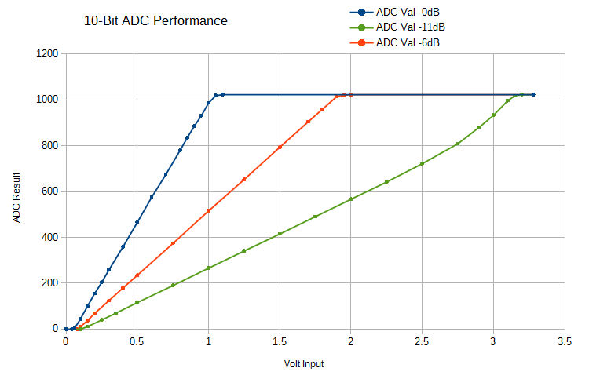

# MicroPython ESP32 ADC1 calibration  
<small><small>using V\_ref calibration value  
**author** jmb52.dev@gmail.com / june 2021</small></small>
    
## Principes 
<small>(a good glimpse is provided in [4]) </small>
 
- 11 dB attenuation is not implemented
- for voltages over 1750 mV use R1 - R2 divider  
- Per design the ADC reference voltage is 1100 mV, however the true
  reference voltage can range from 1000 mV to 1200 mV amongst different
  ESP32s. [1] 
  
### Attenuation and "suggested input ranges" [1]

 Attenuation (dB)|Suggested range (mV)
 :--:|:--:
 0 | 100 ~  950   
 2.5 | 100 ~ 1250   
 6 | 150 ~ 1750  
 ~~11~~ | ~~150 ~ 2450~~   
      
### Linearity

### Minimizing Noise
The ESP32 ADC can be sensitive to noise leading to large discrepancies in ADC readings. To minimize noise, users may connect a 0.1 µF capacitor to the ADC input pad in use. Multisampling may also be used to further mitigate the effects of noise.

ADC noise mitigation

<small>Graph illustrating noise mitigation using capacitor and multisampling of 64 samples.</small>
## Constants 
https://github.com/espressif/esp-idf/blob/master/components/soc/esp32/include/soc/soc.h  
\_DR\_REG\_EFUSE\_BASE      = const(0x3ff5A000)

https://github.com/espressif/esp-idf/blob/master/components/soc/esp32/include/soc/efuse\_reg.h  
\_EFUSE\_ADC\_VREF         = const(0x0000001F)
\_EFUSE\_BLK0\_RDATA4\_REG  = (\_DR\_REG\_EFUSE\_BASE + 0x010)

esp\_adc\_cal\_esp32.c  
\_ADC\_12\_BIT\_RES         = const(4096)  
\_LIN\_COEFF\_A\_SCALE      = const(65536)  
\_LIN\_COEFF\_A\_ROUND      = const(32768) # LIN\_COEFF\_A\_SCALE/2  
\_ADC1\_VREF\_ATTEN\_SCALE  = [57431, 76236, 105481]  
\_ADC1\_VREF\_ATTEN\_OFFSET = [75, 78, 107]  
\_VREF\_REG               = \_EFUSE\_BLK0\_RDATA4\_REG  
\_VREF\_OFFSET            = const(1100)  
\_VREF\_STEP\_SIZE         = const(7)  
\_VREF\_FORMAT            = const(0)  
\_VREF\_MASK              = const(0x1F)

name (string):      instance name (for debugging)  
\_pin (int):         ADC input pin no.  
\_div (float):       voltage divider (V\_in = V\_meas * div)  
\_width (int):       encoded width of ADC result (0...3)  
\_samples (int):     number of ADC samples for averaging  
vref (int):         ADC reference voltage in mV (from efuse calibration data or supplied by programmer)  
\_coeff\_a (float):   conversion function coefficient 'a'  
\_coeff\_b (float):   conversion function coefficient 'b'  

 ## Calibration method

vMes between 0 and 4095
### constants
**\_ADC1\_VREF\_ATTEN\_SCALE**  = [57431, 76236, 105481]  
**\_ADC1\_VREF\_ATTEN\_OFFSET** = [75, 78, 107]  
**\_ADC\_12\_BIT\_RES**         = const(4096)  
**\_LIN\_COEFF\_A\_SCALE**      = const(65536)  
**\_LIN\_COEFF\_A\_ROUND**      = const(32768) # LIN\_COEFF\_A\_SCALE/2  
### coeff
**\_coeff\_a** = vref \* \_ADC1\_VREF\_ATTEN\_SCALE[attenuation] / \_ADC\_12\_BIT\_RES  
**\_coeff\_b** = \_ADC1\_VREF\_ATTEN\_OFFSET[attenuation]
### inputs
**raw_val** : between 0 and 4095  
**vref** : ADC reference voltage in mV (from efuse calibration data or supplied by programmer)
## formula
---  
##### `voltage = {[(\_coeff\_a * raw\_val) + \_LIN\_COEFF\_A\_ROUND] / \_LIN\_COEFF\_A\_SCALE} + \_coeff\_b`
---
## Examples
See class file : esp32-adc-cal.py
## Sources
The calibration algorithm and constants are based on [2].  
[0] https://github.com/matthias-bs/MicroPython-ADC\_Cal
[1] https://docs.espressif.com/projects/esp-idf/en/latest/esp32/api-reference/peripherals/adc.html#adc-calibration  
[2] https://github.com/espressif/esp-idf/blob/master/components/esp\_adc\_cal/esp\_adc\_cal\_esp32.c  
[3] https://docs.micropython.org/en/latest/esp32/quickref.html #adc-analog-to-digital-conversion  
[4] https://esp32.com/viewtopic.php?t=1045 ([Answered] What are the ADC input ranges?)

        
        
        
